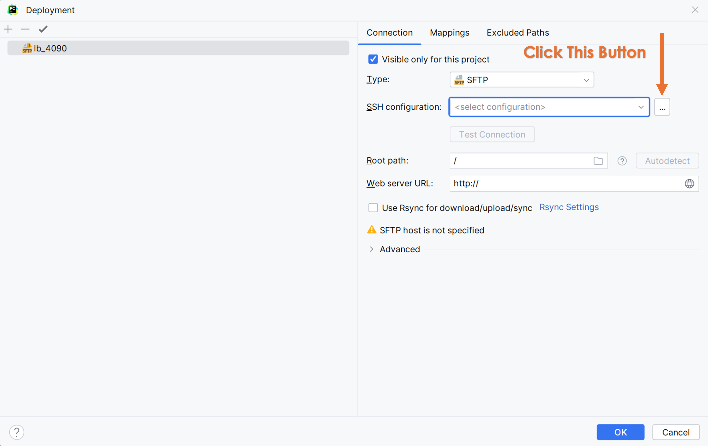
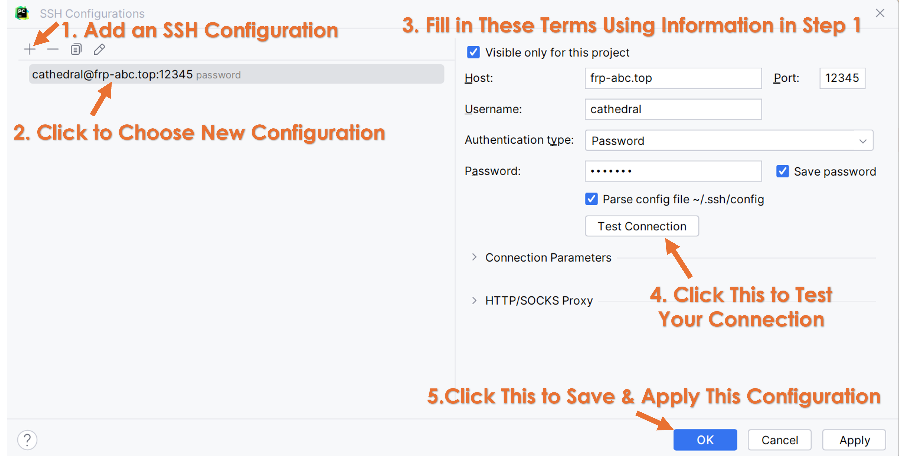

# How to Use SSH
> Update: 2024/2/29 by Xuan Li

## Step 1: 隧道穿透
这里以常用的*Sakura Frp*为例.
- 访问[SakuraFrp](https://www.natfrp.com/user/)注册账号并登陆
- 在网站主页上方栏选中 `服务` - `隧道列表`
- 在`隧道列表`界面, 单击右上角的`创建隧道`
- 在普通节点中选择含有 `推荐SSH` 标签的节点 (e.g. `枣庄多线1`) 单击 
- 创建隧道界面, 填写方式如下:
    - 隧道类型选择`TCP隧道`
    - 隧道名: 填写你要连接的服务器名称, 参考群文件, 如`lb_4090`
    - 备注: 可以不填
    - 本地IP: `127.0.0.1` (留空会默认填写此IP, 可以不填)
    - 本地端口: 下拉栏选择 `[22] SSH`
    - 远程端口: 不填, 其会自动生成
    - 自动HTTPS: 不填 (默认`禁用`)
    - 自动HTTPS工作模式: 不填
    - 访问密码: 单击`生成`后自动填写
    - 访问认证TOTP: 不填
    - 端口导出: 不填 (默认`禁用`)
    - IP白名单: 不填
    - IP黑名单: 不填

    上述项均填完后, 单击右下角的`创建`, 此时隧道列表界面会有一条刚刚创建的隧道信息, 隧道创建完成
- 在隧道配置文件中获取隧道密钥:
    - 单击该隧道的操作按钮`...`'选择`配置文件`
    - 配置文件界面顶端`-f`开头之后, 以一段数字结尾的即为隧道密钥, 单击隧道密钥右侧复制按钮可以复制密钥
    - 假设我们获取的隧道密钥为:
        
        `abcdefghij1kl2mno3pqr3st456uv7w8:66666666 `

- 启动隧道, 首先要在服务器上获取许可, 具体步骤为
    - 使用*ToDesk*访问你要连接的服务器
    - 按`ctrl+alt+T`调出控制台
    - 控制台中输入`frpc -f <隧道密钥>`以启动隧道, 例如
  
        `frpc -f abcdefghij1kl2mno3pqr3st456uv7w8:66666666`
    
    启动成功后控制台会输出包含以下内容的提示:
    ```
        TCP 类型隧道启动成功
        使用 [frp-abc.top:12345] 来连接到你的隧道
    ```
    > *Tips*: 启动成功后，回到你个人电脑的SakuraFrp网站的隧道列表界面并刷新, 会发现该隧道名称前的点变成了绿色, 说明目前该隧道是启动状态.
- 密钥认证, 需要认证才能允许你的个人电脑连接到此隧道
  - 点击该隧道的操作按钮`...`'选择`一键认证`
  - 下拉栏中选择`Windows(x86)`
  - 点击右下角`开始生成`
  - 点击下载生成的以*exe*结尾的认证程序, 并保存
  - 打开程序所在地址, 双击该程序运行, 弹出以下提示说明认证成功, 后可关闭该程序:
    ```
    认证成功, 现在可以正常连接了
    ```
    > *Tips*: 此程序有一定概率在多次运行后提示失败, 若后续可正常SSH访问则不必理会.
- 上述步骤完成后, 可以在配置文件(打开方法见上)中查看隧道关键信息, 例如
    ```
    user: abcdefghij1kl2mno3pqr3st456uv7w8 // 用户识别码
    server_addr: frp-abc.top                // 这是服务器地址
    remote_port: 12345                     // 这是远程端口号
    auth_pass: password                    // 这是之前生成的密码
    ```
## Step 2: 配置连接/访问
> *Warning*: 务必完成第一步后再进行此步.

这里简单介绍两种常用远程方式, 可以自由选择也可以两种都尝试一下, 建议第一种成功后再尝试第二种.

### Method 1 通过PC的cmd直接进行SSH连接控制(易上手) 
#### For Windows 
- 获取需要连接**服务器**的当前用户名. 可以直接询问我们或者通过*ToDesk*连接相应服务器后, 在终端输入`whoami`获取, 假设我们获取到的用户名为:
    ```
        username = cathedral
    ```
- 在本地电脑安装*SSH*服务, 安装方法可以参考:
[Windows下在线与离线安装OpenSSH](https://zhuanlan.zhihu.com/p/666273532)
- 按下`win+R`组合键后输入`cmd`后单击确定, 启动控制台
- 假设第一步中我们获得
    ```
        server_addr = frp-abc.top
        remote_port = 12345
    ```
    则直接在cmd中输入
    ```
        ssh cathedral@frp-abc.top -p 12345 
    ```
- 第一次连接成功后会要求输入系统密码, 各个服务器密码可以私聊询问我们.
    > *Tips*: 输入密码时默认不显示, 不要以为是键盘坏了, 输入完后直接回车即可. 

### Method 2 通过PyCharm配置Deployment进行远程部署(更加系统)
在进行此步之前, 请先确认个人电脑上是否已安装**PyCharm专业版**而非**PyCharm社区版**(*PyCharm Community*). 若未安装, 可以到官网完成学生认证后安装专业版: [JetBrainsAccount](https://account.jetbrains.com/licenses)

- 在**本地**创建一个文件夹, 用于放置所有的远程项目, 将你要进行远程的项目放入此文件夹中. 例如创建的文件夹为`local_dep`, 项目为`demo_project`, 移动后的目录可以为: `E:\local_dep\demo_project`
- 在**服务器**上创建一个个人目录, 进入`/home/<username>/Proj`目录, 创建一个以你的**姓名首字母大写**作为名称的目录, 可以在控制台输入以下指令(假设`username: cathedral`), 便会在`Proj`文件夹下创建一个名为`QWE`的目录
    ```
        cd /home/cathedral/Proj
        mkdir QWE
    ```
    > *Tips*: 不是所有的服务器的工程目录名都为`Proj`, 建议先通过`whoami`指令获取*username*, 再`cd /home/username`到用户目录下, 通过`ls`指令查看所有的子目录名, 然后`cd <子目录名>`到相应的工程目录, 最后再通过`mkdir`创建你的个人目录.
- 在**服务器**上的个人目录中, 创建一个与你将要进行远程的项目同名的目录:
    ```
        cd QWE
        mkdir demo_project
    ```
    在`QWE`目录下, 可以使用`ls`指令查看是否创建成功.
- 在**本地**使用*PyCharm*打开`demo_project`项目
  > *Windows*用户可以右击`demo_project`文件夹, 选择`显示更多选项`-`Open Folder as Pycharm Project`.
- 并在*PyCharm*主页面, 按`Alt + \`打开`Main Menu`, 依次选择`Tools` - `Deployment` - `Configuration`进入远程部署配置
- 先需要创建一个远程服务器, 单击左上角的`+`, 弹出栏中选择`SFTP`, `server name`仍然按照群中文件规则填入服务器命名, 如`lb_4090`
- 配置SSH, 需要用到我们**Step 1**中得到的`serve_addr`和`remote_port`:
  - 单击图中`SSH configuration`右侧的三个点, 打开`SSH configurations`界面
    
  - 在`SSH configurations`界面中, 点击左上角`+`新建一项配置并选中, 并在右侧填写**Step 1**中已经获得的配置信息, 填写完毕后点击`Test Connection`测试连接, 成功后点击`OK`完成*SSH*配置的添加, 如图所示.
    
    > 需要注意, `Host`项填写相应的`<server_addr>`, `Port`项填写相应的`<remote_port>`, `Username`项填写相应的`<username>`, `Password`项填写相应的`<系统密码>`, 密码可以询问我们. 
- 返回到`Deployment`界面后, 选中添加的`lb_4090`, 在右侧`Connection`选项卡中的`SSH configuration`框中选择刚刚配置好的`cathedral@frp-abc.top:12345`, 再点击Root path项右侧的`Autodetect`自动检测当前用户目录, 生成后可查看是否符合`/home/<username>`的格式.
- 配置项目目录映射. 单击`Mappings`选项卡, 确认当前`local path`是否是**本地**项目目录, 例如`E:\local_dep\demo_project`; 将此前在**服务器**上创建的相应的项目目录例如`/home/cathedral/Proj/QWE/demo_project`填入`Deployment path`. 配置完成后单击`OK`即可完成配置. 
    > Deployment path也可以通过点击右侧的小文件夹按钮逐级目录选中, 注意无论如何这个映射不要填写错误, 确认前务必检查目录是否正确.

恭喜到此你已经完成了*PyCharm*远程部署的基本配置, 下面是基于此的几个常用操作:
- **排除目录(非常重要!!!)**
    
    *PyCharm*中, 排除一个目录需要右击该目录后依次选择`Mark Directory as` - `Excluded`, 操作完后该目录变为橙色则说明操作成功.
    > 对于任何一个项目, 在尝试上传到服务器之前, **务必**首先*排除*(*Excluded*)**数据文件夹**, 其他例如模型权重, 图片, 文档等目录也最好排除, 尽量保证只有模型和训练/测试等核心代码部分保留, 以防止其自动上传破坏源数据.
- 上传文件(或目录)
  
  右击想要上传的目录, 依次选择`Deployment` - `Upload to` - `<server name>`, `<server name>`为想要上传至的服务器名.
    > *Tips 1:* 建议只选择小文件(例如`.py`文件)进行上传, 大文件上传速度较慢且容易损坏;

    > *Tips 2:* 在**完成非核心文件夹的排除后**, 谨慎开启自动上传功能, 其可通过按`Alt + \`后依次选择`Tools` - `Deployment` - `Automatic Upload`开启.